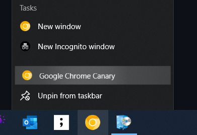
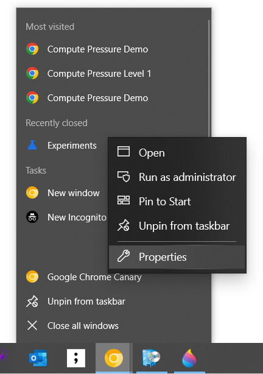
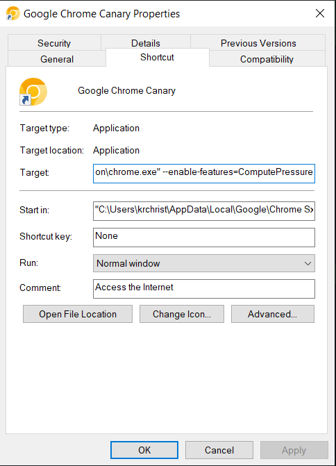

# How to experiment ComputePressure API with Chrome

The [Compute Pressure API](https://www.w3.org/TR/compute-pressure/) is currently available in Chrome Canary and Edge Canary behind a flag.


## Own local Chromium repository (Linux):
1) Rebase to latest HEAD and compile the chromium project.
2) Launch Chrome with the command line flag --enable-features=ComputePressure.
3) Navigate to `about://flags` and enable `Experimental Web Platform features`.
4) Navigate to the demo page, https://w3c.github.io/compute-pressure/demo/.
5) Play with the demo.

## Chrome/Edge Canary (Windows Only):
1) Download a version of Chrome with ComputePressure implemented ([Chrome Canary](https://www.google.com/intl/en_ie/chrome/canary/)) ([Edge Canary](https://www.microsoftedgeinsider.com/en-us/download/canary)).
2) Find your Canary browser in the menu. <br />  <br />
3) Click right and select "properties". <br />  <br />
4) Add to the command line flags --enable-features=ComputePressure. (after the last ") <br />  <br />
5) Start your browser.
6) Navigate to `about://flags` and enable `Experimental Web Platform features`.
7) Navigate to the demo page, https://w3c.github.io/compute-pressure/demo/.
8) Play with the demo.

## Code Examples:

```javascript
// Observer Callback.
function pressureObserverCallback(updates) {
  console.log("cpu pressure state = " + updates[0].state);
  console.log("timestamp = " + updates[0].time);
}

// Create observer with 1000ms sample interval.
observer = new PressureObserver(pressureObserverCallback);

// Start observer.
await observer.observe("cpu", { sampleInterval: 1_000 });
```

You should see, everytime the state changes, the following:

```
cpu pressure state = nominal
timestamp = 1671114838027.834

cpu pressure state = serious
timestamp = 1671114914289.584

cpu pressure state = critical
timestamp = 1671114926328.48
```

Stopping observer:
```
// Stop observer.
observer.unobserve('cpu');
```

Other API calls and examples can be found in the specification.
